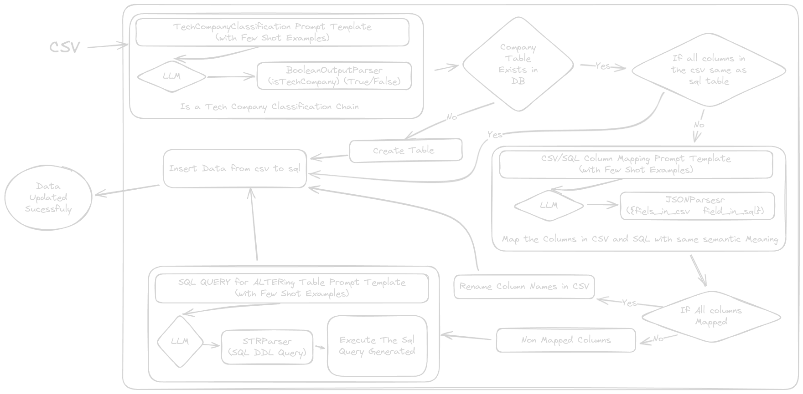

# Company Classifier

## Description

Company Classifier is a simple project designed to streamline MLOps for identifying company details from CSV files, classifying them, and saving them to an SQL-based database. This project leverages FastAPI for the web framework, Pandas for data manipulation, and SQLAlchemy for database interactions.



## Features

- Upload CSV files containing company data.
- Automatically map and rename columns based on predefined mappings.
- Save the processed data to an SQL database.
- Prevent duplicate entries in the database.
- Incrementally Update the SQL table to accomodate for the new colums/fields (Future Proof)

## Requirements

- Python 3.12
- Poetry for dependency management
- [Optional] Docker, Docker Compose

## Installation

1. **Clone the repository:**

    ```sh
    git clone https://github.com/h3110Fr13nd/company-classifier.git
    cd company-classifier
    ```

2. **Set up the environment variables:**

    Create a [`.env`](.env) file in the root directory and add the following:

    ```env
    DATABASE_URL=your_database_url
    GOOGLE_API_KEY=your_gemini_api_key
    ```

## Usage

1. **Run the application:**

    ```sh
    poetry install
    poetry run uvicorn app.main:app --host 0.0.0.0 --port 8000
    ```
    ##### OR Using docker compose

    ```sh
    docker compose up
    ```


2. **Upload CSV files:**

    Use an API client like Postman or cURL to upload CSV files to the `/upload/` endpoint.

    Example using `curl`:

    ```sh
    curl -X POST "http://0.0.0.0:8000/upload/" -F "file=@path/to/your/file.csv"
    ```

## Project Structure

```
.env
.flake8
.gitignore
.pre-commit-config.yaml
app/
    __pycache__/
    db.py
    main.py
    prompts.py
    utils.py
docker-compose.yaml
Dockerfile
poetry.lock
pyproject.toml
README.md
temp.py
temp2.py
test_csvs/
    companies1.csv
    companies2.csv
    ...
```

## Key Files

- **[`app/main.py`](app/main.py):** Contains the FastAPI application and the `/upload/` endpoint.
- **[`app/utils.py`](app/utils.py):** Contains utility functions for processing CSV files, Langchain Chaining with DB, LLM, Parsers.
- **[`app/prompts.py`](app/prompts.py):** Contains The Few Shot Prompt Templates, highly caliberated to give accurate Outputs.
- **[`Dockerfile`](Dockerfile):** Docker configuration for containerizing the application.
- **[`pyproject.toml`](pyproject.toml):** Project dependencies and configuration.


## Contact

For any inquiries, please contact [h3110Fr13nd](mailto:vijaysinghkushwaha3737@gmail.com).